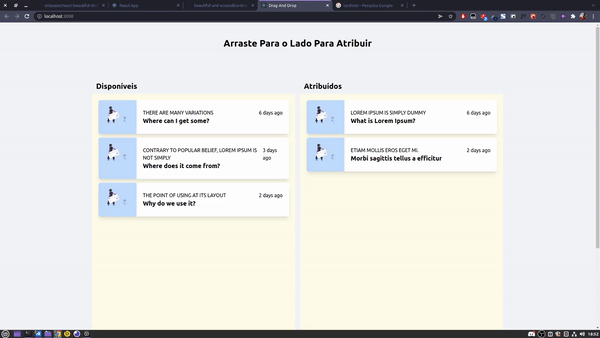

# POC - react-beautiful-dnd

## Aplicação Funcionando



<br/>
<br/>

## Acesse o Projeto <a href="https://beautiful-and-accessible-drag-and-drop-for-list.vercel.app/" __blank >Aqui</a>

<br/>

## Observações

- Isso é uma prova de conceito.
- Não tem responsividade.
- Algumas tipagens estão como any para adiantar o processo de teste.

<br />

## Tecnologias

- TailwindCSS
- React
- React Beautiful DND
- HTML
- CSS

## Rodando o projeto

```bash
# install
$ yarn

# watch mode development
$ yarn build

# production mode
$ npm run start:prod
```

## Entre em contato

- Autor - [Carlos Eduardo](https://portfolio-carlos-eduardo-dias-batista.vercel.app/)

## Licença

Is [MIT licensed](LICENSE).
